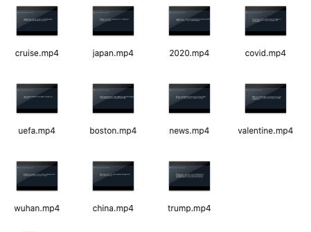

# HW5:twitter-summarizer-rest-service-noracnr
https://noracnr.github.io/twitter-summarizer-rest-service-noracnr/

In demo, Please try keywords except 'Breaking', 'hello','italy','covid-19','covid19'. cause I don't deal with the processed keywords. Thanks.

### Main Exercise(Summarizer.py)
Using the twitter feed, construct a daily video summarizing a twitter handle day
* Convert text into an image in a frame 
* Do a sequence of all texts and images in chronological order.
* Display each video frame for 3 seconds

### Guide
This application requires python3, Twython, FFmpeg. 
Make sure prepare your own twitter api keys, then put them a file named 'keys' without any extention in root program directory.Here is the format of api keys:
```
[auth]
consumer_key = ****
consumer_secret = ****
access_token = ****
access_secret = ****
```
To run this program, run summarizer.py for single thread, and run queue_system.py for Queue with multi-threading.
```bash
python3 summarizer.py
python3 queue_system.py
```
### Restful Api(restApi.py)
EC2 server: ec2-3-133-92-223.us-east-2.compute.amazonaws.com:8080
* Open another bash and run:
```bash
curl -X POST -d "keyword=covid19" http://ec2-3-133-92-223.us-east-2.compute.amazonaws.com:8080/
```
* You can change 'covid19' to any keyword. Here is the result of this command line:
```json
{
  "get_status": "3.133.92.223:8080/status/covid19", 
  "get_video": "3.133.92.223:8080/video/covid19", 
  "keyword": "covid19"
}
```
* You can check the status of twitter summarizer like this.
```bash
 curl http://ec2-3-133-92-223.us-east-2.compute.amazonaws.com:8080/status/covid19
```
```json
{
  "error": "", 
  "keyword": "covid19", 
  "status": "finished"
}
```
* Also, watch the video in a browser when you type '3.133.92.223:8080/video/covid19' in the address bar. Like that,
  
  
##### Customize
You can generate your own object in summarizer.py. For example, if you want to generate a video called "news.mp4" about Breaking News, you can use in this way:
```python3
# parameter1: search keyword of twitter 
# parameter2: expected video name
# parameter3: your keys file[ Default Name]

customizedObject = Summarizer("Breaking","news","keys")

# call api and creating news.mp4
customizedObject.keyToVideo()
```

##### Result
Check img and news.mp4.
Here is the result of queue_system.py



### Answers of tasks
* How many API calls you can handle simultaneously and why?

I only call Twitter API for this time. I have one worker with 10 threads using api simultaneously in queue_system.py.

* For example, run different API calls at the same time?

Yes.

* Split the processing of an API into multiple threads?

I can split a process into multiple threads using threading library, but in summarizer.py , I only use one thread for creating images and video after geting callback from twitter api. In queue_system.py, I use 10 threads for calling api synchronously.

